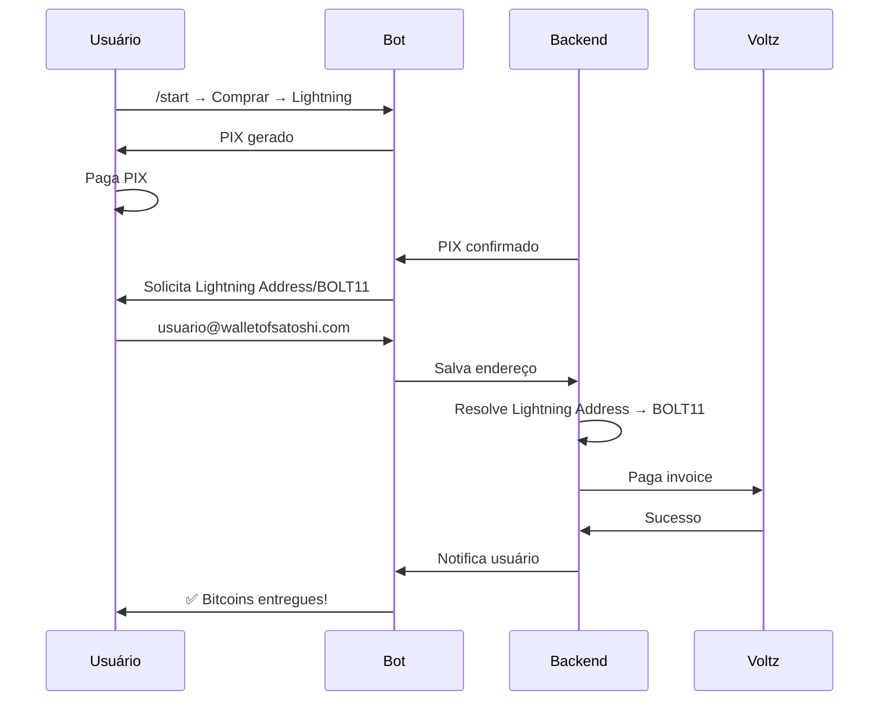
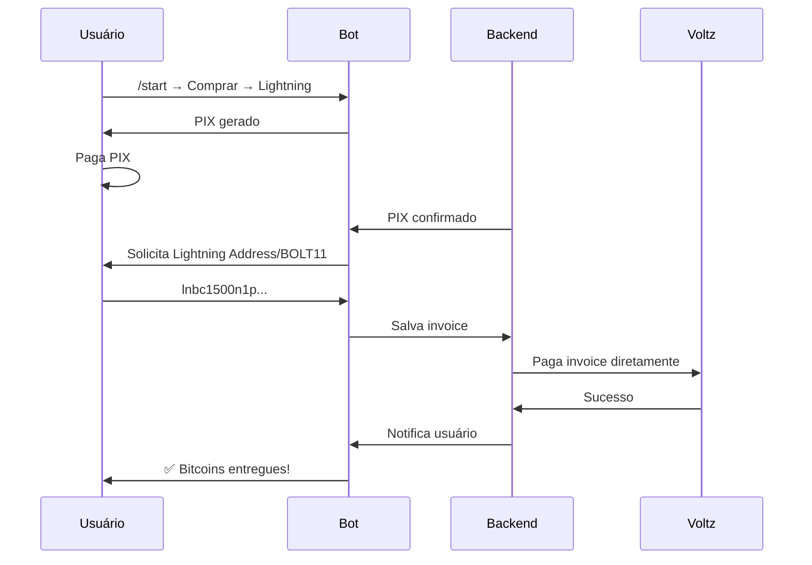

# 📚 Ghost Bot - Índice de Documentação

**Atualizado:** 2025-01-08  
**Versão:** 2.0  

---

## 🏠 **Visão Geral do Projeto**

O **Ghost Bot** é um assistente de criptomoedas completo que oferece:
- 💰 Compra/venda de Bitcoin, USDT e outras criptomoedas
- ⚡ **Lightning Network** com suporte a Lightning Address
- 💳 Pagamentos via PIX, TED e Boleto
- 🔄 Integração com APIs Voltz, DePix e CoinGecko
- 🤖 Bot Telegram interativo e amigável

---

## 📖 **Documentação Principal**

### **🔧 Implementações Técnicas**

#### **⚡ Lightning Network**
- **[LIGHTNING_ADDRESS_IMPLEMENTACAO.md](LIGHTNING_ADDRESS_IMPLEMENTACAO.md)** - **✨ NOVO**
  - Implementação completa de Lightning Address
  - Suporte a endereços amigáveis (`user@domain.com`)
  - Detecção automática Lightning Address vs BOLT11
  - Integração backend + bot + testes

- **[LIGHTNING_ADDRESS_VOLTZ_ANALISE.md](LIGHTNING_ADDRESS_VOLTZ_ANALISE.md)**
  - Análise de compatibilidade Lightning Address com Voltz
  - Pesquisa sobre protocolos LNURL
  - Conclusões sobre implementação necessária

#### **🔗 Protocolos e APIs**
- **[envio.md](envio.md)**
  - Documentação da extensão LNURL-withdraw da Voltz
  - Endpoints para criar e gerenciar links de saque
  - Exemplos de uso com curl

---

## 🎯 **Funcionalidades por Categoria**

### **⚡ Lightning Network**
- ✅ **Lightning Address:** `user@walletofsatoshi.com`
- ✅ **BOLT11 Invoices:** Suporte tradicional
- ✅ **Detecção automática:** Sistema identifica o formato
- ✅ **Resolução LUD-16:** Lightning Address → BOLT11
- ✅ **Integração Voltz:** Pagamentos via API
- ✅ **Callbacks educativos:** Ajuda contextual no bot

### **💰 Moedas Suportadas**
- ₿ **Bitcoin (BTC)** - Mainnet e Lightning
- 💵 **Tether (USDT)** - Polygon e outras redes
- 💠 **Depix** - Token nativo da plataforma

### **💳 Métodos de Pagamento**
- 💠 **PIX** - Instantâneo
- 🏦 **TED** - Transferência bancária
- 📄 **Boleto** - Pagamento tradicional

### **🔧 Integrações Externas**
- **Voltz API:** Lightning Network e pagamentos
- **DePix API:** Processamento de depósitos
- **CoinGecko API:** Cotações em tempo real
- **Telegram Bot API:** Interface do usuário

---

## 🏗️ **Arquitetura do Sistema**

### **Backend PHP** (`/ghostbackend/`)
```
├── api/
│   ├── lightning_cron_endpoint_final.php    ✨ NOVO - Processador unificado
│   ├── save_lightning_address.php           ✨ NOVO - API persistência
│   ├── lightning_address_processor.php      - Processador backend-first
│   └── ...outros endpoints
├── classes/
│   ├── LightningAddressResolver.php         ✨ NOVO - Resolução LUD-16
│   └── ...outras classes
├── voltz/
│   ├── voltz_rest.php                       - Integração Voltz API
│   └── ...outros módulos voltz
└── config/
    └── ...configurações
```

### **Bot Python** (`/ghost/`)
```
├── handlers/
│   ├── lightning_integration.py             ✅ ATUALIZADO - Suporte Lightning Address
│   └── ...outros handlers
├── menus/
│   ├── menu_compra.py                       ✅ ATUALIZADO - Instruções Lightning Address
│   └── ...outros menus
├── api/
│   └── lightning_address.py                 - Script teste Python
├── docs/
│   ├── LIGHTNING_ADDRESS_IMPLEMENTACAO.md   ✨ NOVO - Documentação completa
│   ├── LIGHTNING_ADDRESS_VOLTZ_ANALISE.md   - Análise Voltz
│   ├── envio.md                             - LNURL-withdraw docs
│   └── INDEX.md                             ✅ ESTE ARQUIVO
└── test_lightning_address_flow.py           ✨ NOVO - Testes automatizados
```

---

## 🔄 **Fluxos Principais**

### **1. Compra com Lightning Address**


### **2. Fluxo Tradicional BOLT11**


---

## 🧪 **Testes e Validação**

### **Script de Teste Automatizado**
```bash
# Localização
/ghost/test_lightning_address_flow.py

# Uso
python3 test_lightning_address_flow.py --quick    # Teste rápido
python3 test_lightning_address_flow.py            # Teste completo
python3 test_lightning_address_flow.py --cron-only # Apenas cron
```

### **Casos de Teste Cobertos**
- ✅ Validação de formatos (Lightning Address + BOLT11)
- ✅ Resolução LUD-16 real
- ✅ Persistência no banco de dados
- ✅ Processamento via cron
- ✅ Detecção de erros e formatos inválidos
- ✅ Integração com APIs externas

---

## 📊 **Métricas e Monitoramento**

### **Logs Implementados**
- 🔍 **Lightning Address:** Resolução LUD-16 detalhada
- 🔍 **Voltz API:** Chamadas e respostas
- 🔍 **Processamento:** Status de cada depósito
- 🔍 **Erros:** Falhas categorizadas para debug

### **APIs de Status**
- 📊 **Cron Stats:** `/api/lightning_cron_endpoint_final.php`
- 📊 **Address Validation:** `/api/save_lightning_address.php`
- 📊 **Resolução Test:** `/testphp/test_lightning_address.php`

---

## 🚀 **Status do Projeto**

### **✅ Implementado e Funcionando**
- Lightning Address completo (LUD-16)
- BOLT11 traditional support
- Bot Python integrado
- Backend PHP robusto
- Testes automatizados
- Documentação completa

### **🔄 Melhorias Futuras (Opcional)**
- Cache de resoluções Lightning Address
- Múltiplos endereços por usuário
- Tutorial interativo no bot
- Métricas de adoção em dashboard

---

## 🤝 **Contribuição e Suporte**

### **Para Desenvolvedores**
1. Clone os repositórios `ghost` e `ghostbackend`
2. Configure as variáveis de ambiente
3. Execute os testes: `python3 test_lightning_address_flow.py`
4. Consulte esta documentação para entender os fluxos

### **Para Usuários**
- Use `/start` no bot para começar
- Suporte a Lightning Address: `usuario@dominio.com`
- Suporte a BOLT11: `lnbc1...`
- Callbacks de ajuda disponíveis no bot

---

**🎉 O Ghost Bot agora oferece a experiência Lightning mais completa e amigável do mercado brasileiro!**
